# 数据模型设计 (Data Model)

> 本文件是项目的**物理数据模型单一事实源**。所有表名、字段名、外键、派生规则以本文件 + `sql/01_schema.sql` 为准。
> 业务术语含义见 `docs/GLOSSARY.md`,业务硬性规则见 `docs/BUSINESS_RULES.md`,本文档**不重复**这些内容,只做"数据怎么落表"的说明。
> 修改 schema 时必须同步四处(见 `BUSINESS_RULES.md` R7):`sql/01_schema.sql` + `tools/local_validator.py::SQLITE_SCHEMA` + `tools/csv_to_sql.py::DERIVED_RULES` + `sample/templates/*_template.csv`（第 4 处模板表头由 `scripts/check-template-schema-sync.sh` 自动兜底）。

---

## 1. 概述:9 大模块

系统按业务流程切成 9 个模块,每个模块解决一个问题:

| 模块 | 职责(一句话) |
| --- | --- |
| **基础资料** | 物料、仓库、供应商、客户这四类"目录数据",被其他模块引用,本身不带价格 |
| **采购** | 向供应商签的进货单(PO),承诺值,对应未来入库 |
| **库存** | 当前库存余额、入库单、出库单、出入库流水;库存是结果,流水是原因 |
| **销售** | 跟客户签的销售合同(SC),承诺数 + 单价 + 外币金额四件套 |
| **发货** | 内部装柜指令(DO),计划数 vs 实际装柜数,衔接合同账与报关账 |
| **报关** | 装船后给海关看的实际数据(SH/CI/PL),含唛头/毛净重/CBM;差异超 5% 走 credit_note |
| **收款** | 客户付款记录 + 月固定汇率折算 CNY,做应收对账 |
| **调拨** | 仓库间挪货,复用 stock_in/stock_out,通过 `transfer_ref` 软关联配对,不进报关/收款 |
| **报价** | 签合同前的报价环节,KG×系数定价;简要报价(brief)→正式 QT(formal)→销售合同(PI)派生链 |

> 9 个模块的串行流程见 `docs/GLOSSARY.md §1 流程时序`。本文档关注"每张表长什么样"。
> 报价模块的业务规则见 `BUSINESS_RULES.md R10`,设计取舍见 `docs/adr/0003-quotation-derive-from-brief.md`。

---

## 2. 表清单总览

共 **25 张表**(18 张主表 + 7 张明细表),全部源自 `sql/01_schema.sql`,与 `tools/local_validator.py::SQLITE_SCHEMA` 一一对应。

| # | 表名 | 所属模块 | 职责 | 含明细子表 |
| --- | --- | --- | --- | --- |
| 1 | `products` | 基础资料 | 物料主数据(线管/管材的属性字典),不带价格 | — |
| 2 | `warehouses` | 基础资料 | 仓库目录 | — |
| 3 | `suppliers` | 基础资料 | 供应商名录(含本公司 `is_self=1`),含开票/收款资料全文 | — |
| 4 | `customers` | 基础资料 | 客户名录,含品牌名、开票资料全文 | — |
| 5 | `purchase_orders` | 采购 | 采购单主表(PO),CNY 计价 | ✅ `purchase_order_items` |
| 6 | `purchase_order_items` | 采购 | 采购明细(一行一物料) | — |
| 7 | `sales_contracts` | 销售 | 销售合同主表(SC),外币金额四件套 | ✅ `sales_contract_items` |
| 8 | `sales_contract_items` | 销售 | 合同明细(合同数 + 单价 + 已发数) | — |
| 9 | `inventory` | 库存 | 当前库存余额(物料 + 仓库 = 一行) | — |
| 10 | `stock_in` | 库存 | 入库单主表;`in_type` 区分采购/生产/调拨/退货 | ✅ `stock_in_items` |
| 11 | `stock_in_items` | 库存 | 入库明细 | — |
| 12 | `stock_out` | 库存 | 出库单主表;`out_type` 区分销售/生产/调拨/报废 | ✅ `stock_out_items` |
| 13 | `stock_out_items` | 库存 | 出库明细 | — |
| 14 | `stock_logs` | 库存 | 出入库统一流水(自动重建),`inventory` 是结果它是原因 | — |
| 15 | `delivery_orders` | 发货 | 发货单主表(DO),合同账的执行 | ✅ `delivery_order_items` |
| 16 | `delivery_order_items` | 发货 | 发货明细(计划数 + 实际数 + 短装数自动算) | — |
| 17 | `shipping_records` | 报关 | 报关单据主表(SH),报关账的起点,含金额四件套 | ✅ `shipping_record_items` |
| 18 | `shipping_record_items` | 报关 | 报关明细(唛头/毛净重/CBM/USD 单价) | — |
| 19 | `credit_notes` | 报关 | 贷记单(CN),衔接两套账差异,含金额四件套 | — |
| 20 | `exchange_rates` | 收款 | 月固定汇率表(每月 1 日一条) | — |
| 21 | `receipts` | 收款 | 客户收款单(RC),按 `paid_date` 查汇率折算 CNY | — |
| 22 | `audit_logs` | 审计 | 审计日志(阶段一空壳,阶段二接业务) | — |
| 23 | `quotation_params` | 报价 | 报价全局参数(键值对,如默认汇率/币种/有效期) | — |
| 24 | `quotations` | 报价 | 报价主表,简要报价(brief)与正式 QT(formal)共用 | ✅ `quotation_items` |
| 25 | `quotation_items` | 报价 | 报价明细(KG×系数定价,4 个派生字段) | — |

> **调拨没有独立表**——它复用 `stock_in` + `stock_out`,通过 `transfer_ref` 软关联实现。设计理由见 §6。

---

## 3. ER 关系图

下图只画**主外键关系**(实线 = `FOREIGN KEY`),不画索引和派生字段。所有箭头从"明细/从表"指向"主表/字典"。

```mermaid
erDiagram
    %% ===== 基础资料 =====
    products ||--o{ purchase_order_items : "被引用"
    products ||--o{ sales_contract_items : "被引用"
    products ||--o{ stock_in_items       : "被引用"
    products ||--o{ stock_out_items      : "被引用"
    products ||--o{ inventory            : "被引用"
    products ||--o{ stock_logs           : "被引用"
    products ||--o{ delivery_order_items : "被引用"
    products ||--o{ shipping_record_items: "被引用"
    products ||--o{ credit_notes         : "被引用"

    warehouses ||--o{ inventory      : "被引用"
    warehouses ||--o{ stock_in       : "被引用"
    warehouses ||--o{ stock_out      : "被引用"
    warehouses ||--o{ stock_logs     : "被引用"

    suppliers ||--o{ purchase_orders : "fk_po_supplier"

    customers ||--o{ sales_contracts   : "fk_sc_customer"
    customers ||--o{ delivery_orders   : "fk_do_customer"
    customers ||--o{ receipts          : "fk_rc_customer"

    %% ===== 采购 =====
    purchase_orders ||--o{ purchase_order_items : "fk_poi_po ON DELETE CASCADE"
    purchase_orders ||--o{ stock_in             : "fk_si_po (采购入库时填)"

    %% ===== 销售 =====
    sales_contracts ||--o{ sales_contract_items : "fk_sci_contract ON DELETE CASCADE"
    sales_contracts ||--o{ receipts             : "fk_rc_contract (可空)"
    sales_contract_items ||--o{ delivery_order_items : "fk_doi_contract_item"
    sales_contract_items ||--o{ credit_notes         : "fk_cn_contract_item"

    %% ===== 库存 =====
    stock_in  ||--o{ stock_in_items  : "fk_sii_si ON DELETE CASCADE"
    stock_out ||--o{ stock_out_items : "fk_soi_so ON DELETE CASCADE"
    %% stock_logs.source_id 软指向 stock_in/stock_out 主键 (无硬外键, source_type 区分)

    %% ===== 发货 =====
    delivery_orders ||--o{ delivery_order_items : "fk_doi_delivery ON DELETE CASCADE"
    delivery_orders ||--o{ stock_out            : "fk_so_delivery (销售出库时填)"
    delivery_orders ||--o{ shipping_records     : "fk_sr_delivery"
    delivery_orders ||--o{ receipts             : "fk_rc_delivery (可空)"

    %% ===== 报关 =====
    shipping_records ||--o{ shipping_record_items : "fk_sri_shipping ON DELETE CASCADE"
    shipping_records ||--o{ credit_notes          : "fk_cn_shipping"
    shipping_records ||--o{ receipts              : "fk_rc_shipping (可空)"

    %% ===== 报价 =====
    customers ||--o{ quotations       : "fk_quo_customer"
    quotations ||--o{ quotation_items : "fk_qi_quote ON DELETE CASCADE"
    quotations ||--o{ quotations      : "fk_quo_parent (自引用, formal→brief)"
    products   ||--o{ quotation_items : "fk_qi_product (带出重量/体积)"
```



> **注意**:`stock_in.transfer_ref` 与 `stock_out.transfer_ref` 是**软关联**(没有外键约束),靠应用层校验配对(见 §6),所以不出现在 erDiagram 里。
> `stock_logs.source_id` 也是软关联,`source_type` 字段决定它指向 `stock_in` 还是 `stock_out`。

---

## 4. 每张表详解

> 字段只列"业务关键字段 + 外键 + 派生字段"。完整字段定义看 `sql/01_schema.sql`,本节不再抄一遍。
> "状态机"术语见 `docs/GLOSSARY.md §2 单据状态`。

### 4.1 基础资料

#### `products` — 物料主数据
- **职责**:存线管/管材的属性字典(尺寸、重量、外观、包装等)。**不带价格**——价格跟着业务单据(PO/SC)走。
- **关键字段**:
  - 标识:`material_id`(企业内部唯一,如 M-001)、`customer_code`、`product_category`(决定密度公式)
  - 尺寸:`inner_diameter`(mm)、`thickness`(mm)、`outer_diameter`(派生)、`id_x_od`(派生)、`length`(m)
  - 重量:`weight_per_meter`(g/m)、`weight`(kg)
  - 外观:`appearance_outer`、`appearance_height`、`volume`(派生)
- **外键**:无(基础字典)
- **派生字段**:✅ 见 §5(7 个:厚度反推、外径、内径x外径、单重、米重、体积、体积小计)
- **路由约定**:密度/厚度/米重 → `product-params` skill;外径/体积 → `derived-fields` skill

#### `warehouses` — 仓库目录
- **职责**:登记你有哪几个仓(`code` 如 WH-01)。
- **关键字段**:`code`、`name`、`address`、`is_active`
- **外键**:无
- **派生字段**:无

#### `suppliers` — 供应商名录(含本公司 is_self=1)
- **职责**:进货对方(卖原材料给你的厂家),**外加本公司**(用 `is_self=1` 标记)。合同模板通过 `WHERE is_self=1` 调取本公司的 `company_profiles`/`billing_profiles` 作卖方信息。
- **关键字段**:`code`、`name`、`contact_person`、`phone`、`address`、`bank_account`、`company_profiles`(TEXT 全文,中文开票资料)、`billing_profiles`(TEXT 全文,外币账户资料)、`is_self`(1=本公司/卖方,0=外部供应商)、`is_active`
- **唯一索引**:`idx_suppliers_is_self`(`is_self` 字段索引,便于合同模板快速调取)
- **校验约束**:`check_master_data` 校验 `is_self=1` 恰好 1 条(0 条 WARN"无法调取卖方信息",>1 条 WARN"目前只支持 1 家本公司")
- **外键**:无
- **派生字段**:无

#### `customers` — 客户名录
- **职责**:卖货对方(买你成品的客户),含品牌名、开票/收款资料全文。
- **关键字段**:`code`、`name`、`brand_name`(如 PAGODA)、`company_profiles`、`billing_profiles`
- **外键**:无
- **派生字段**:无

> `company_profiles` / `billing_profiles` 是多行 TEXT 字段,合同模板调取时还原成原始格式。`sql_escape()` 函数已处理换行/引号转义。

### 4.2 采购模块

#### `purchase_orders` — 采购单主表
- **职责**:跟供应商签的进货单,**CNY 计价**(采购是内购,不走外币四件套)。
- **关键字段**:`po_no`(如 PO20260726001)、`supplier_id`、`order_date`、`expected_date`、`total_amount`(CNY)、`total_volume`(展示用统计,= Σ 明细 `volume_subtotal`,DECIMAL(10,4))、`status`
- **状态机**:`draft` / `confirmed` / `partial_received` / `received` / `cancelled`(比通用四态多了两个到货中间态)
- **外键**:`supplier_id → suppliers(id)`
- **派生字段**:无(金额在明细层算)
- **校验**:`check_purchase_orders`(步骤 2/16):主表 `total_amount` 必须等于明细 `subtotal` 之和;`total_volume` 应等于 Σ 明细 `volume_subtotal`(WARN 级,容差 0.01)

#### `purchase_order_items` — 采购明细
- **职责**:一行一种物料。
- **关键字段**:`po_id`、`product_id`、`quantity`、`unit_price`(CNY/件)、`subtotal`(派生)、`volume_subtotal`(派生)、`received_qty`(回写)
- **外键**:`po_id → purchase_orders(id) ON DELETE CASCADE`、`product_id → products(id)`
- **唯一约束**:`uk_poi_po_product (po_id, product_id)` —— 同一采购单同一物料只能一行
- **派生字段**:✅ `subtotal` = 数量 × 单价;`volume_subtotal` = 单件体积 × 数量

### 4.3 销售模块

#### `sales_contracts` — 销售合同主表
- **职责**:跟客户签的合同,**外币金额四件套**(详见 §7)。
- **关键字段**:`contract_no`、`customer_id`、`sign_date`、`delivery_deadline`、金额四件套(`total_amount` + `currency` + `exchange_rate` + `total_amount_cny`)、`total_volume`(展示用统计,= Σ 明细 `volume_subtotal`,DECIMAL(10,4))、贸易术语(`trade_terms`/`port_loading`/`port_discharge`/`freight`/`insurance`)、**付款/包装条款**(`payment_term` 自由文本、`packing` 自由文本,2026-07-29 加,从 formal 报价转单时拷贝)、`status`
- **状态机**:`draft` / `confirmed` / `delivering` / `completed` / `cancelled`
- **外键**:`customer_id → customers(id)`
- **派生字段**:✅ `total_amount_cny` = `total_amount` × `exchange_rate`
- **校验**:`check_sales_contracts`(步骤 4/16):主表金额必须等于明细小计之和;`total_volume` 应等于 Σ 明细 `volume_subtotal`(WARN 级,容差 0.01)

#### `sales_contract_items` — 销售合同明细
- **职责**:合同的商品行。
- **关键字段**:`contract_id`、`product_id`、`quantity`(合同数)、`unit_price`、`subtotal`(派生)、`volume_subtotal`(派生)、`delivered_qty`(由发货单回写)
- **外键**:`contract_id → sales_contracts(id) ON DELETE CASCADE`、`product_id → products(id)`
- **唯一约束**:`uk_sci_contract_product`
- **派生字段**:✅ `subtotal`、`volume_subtotal`

### 4.4 库存模块

#### `inventory` — 当前库存
- **职责**:"某仓某物料现在还剩多少"。**一个物料 + 一个仓库 = 一行记录**。
- **关键字段**:`product_id`、`warehouse_id`、`quantity`
- **唯一约束**:`uk_product_warehouse (product_id, warehouse_id)`
- **外键**:`product_id`、`warehouse_id`
- **派生字段**:无
- **校验**:`check_reconciliation`(步骤 7/16):`inventory` 必须等于 `stock_logs` 流水累加,不平报 ERROR

#### `stock_in` — 入库单主表
- **职责**:货物实际进仓的凭证。来源由 `in_type` 区分。
- **关键字段**:`in_no`、`in_type`(ENUM: `purchase`/`production`/`transfer`/`return`)、`warehouse_id`、`po_id`(采购入库时填)、`in_date`、`status`、`transfer_ref`(调拨入库时填,与配对 `stock_out` 同号)
- **状态机**:`draft` / `confirmed` / `cancelled`
- **外键**:`warehouse_id → warehouses(id)`、`po_id → purchase_orders(id)`
- **派生字段**:无
- **索引**:`idx_si_transfer` 加在 `transfer_ref` 上,加速调拨配对查询

#### `stock_in_items` — 入库明细
- **职责**:入库单的商品行。
- **关键字段**:`stock_in_id`、`product_id`、`quantity`
- **外键**:`stock_in_id → stock_in(id) ON DELETE CASCADE`、`product_id → products(id)`
- **派生字段**:无

#### `stock_out` — 出库单主表
- **职责**:货物实际出仓的凭证。来源由 `out_type` 区分。
- **关键字段**:`out_no`、`out_type`(ENUM: `sale`/`production`/`transfer`/`scrap`)、`warehouse_id`、`delivery_id`(销售出库时填)、`out_date`、`status`、`transfer_ref`(调拨出库时填)
- **状态机**:`draft` / `confirmed` / `cancelled`
- **外键**:`warehouse_id → warehouses(id)`、`delivery_id → delivery_orders(id)`
- **派生字段**:无
- **索引**:`idx_so_transfer` 加在 `transfer_ref` 上

#### `stock_out_items` — 出库明细
- **职责**:出库单的商品行。
- **关键字段**:`stock_out_id`、`product_id`、`quantity`
- **外键**:`stock_out_id → stock_out(id) ON DELETE CASCADE`、`product_id → products(id)`
- **派生字段**:无

#### `stock_logs` — 出入库流水
- **职责**:统一的流水账本。所有入库/出库操作自动写一条,用于对账和追溯。`inventory` 是"结果",`stock_logs` 是"原因"。
- **关键字段**:`product_id`、`warehouse_id`、`change_qty`(入库正、出库负)、`after_qty`、`source_type`(ENUM: `stock_in`/`stock_out`/`adjust`)、`source_id`、`source_no`(冗余字段,方便查询)
- **外键**:`product_id`、`warehouse_id`(`source_id` 是软关联,无硬外键)
- **派生字段**:无
- **重建机制**:`tools/local_validator.py::rebuild_stock_logs` 每次校验前根据 `stock_in_items` + `stock_out_items` 重建,保证流水与明细一致

### 4.5 发货模块

#### `delivery_orders` — 发货单主表
- **职责**:给客户送货的凭证(合同账的执行)。一次发货可能对应多个合同明细(同一客户多个合同一起发)。
- **关键字段**:`delivery_no`、`customer_id`、`delivery_date`、`receiver`/`receiver_phone`/`receiver_address`、`transport_no`、`total_volume`(展示用统计,= Σ 明细 `volume_subtotal`,DECIMAL(10,4))、`status`
- **状态机**:`draft` / `confirmed` / `shipped` / `delivered` / `cancelled`
- **外键**:`customer_id → customers(id)`
- **派生字段**:无
- **校验**:`check_delivery_order_volume`(步骤 9/16):主表 `total_volume` 应等于 Σ 明细 `volume_subtotal`(WARN 级,容差 0.01 CBM)。⚠️ **这个 total_volume 跟下面 shipping_records 的 total_cbm 是两个概念**——前者是按计划数累加的展示统计(给客户看),后者是装柜后报关真实数(要交海关)。

#### `delivery_order_items` — 发货明细
- **职责**:发货单的商品行,每行关联一个合同明细。**两套账机制的落点**(见 `BUSINESS_RULES.md` R3)。
- **关键字段**:
  - `delivery_id`、`contract_item_id`(回写已发数量用)、`product_id`
  - `quantity`(计划发货数,商务承诺,**不改**)
  - `actual_quantity`(实际装柜数,装柜后填,默认 = `quantity`)
  - `short_qty`(短装数,**数据库 GENERATED**)
  - `volume_subtotal`(派生)
- **外键**:`delivery_id → delivery_orders(id) ON DELETE CASCADE`、`contract_item_id → sales_contract_items(id)`、`product_id → products(id)`
- **派生字段**:✅ `short_qty` = `quantity - actual_quantity`(正=短装,负=超装)
  - **唯一例外**:这是项目里**唯一走 DB 生成列**的派生字段(MySQL `GENERATED ALWAYS AS ... STORED`),因为它是纯行内计算,无需跨表。
  - 其他派生字段默认走应用层(Python),见 `BUSINESS_RULES.md` R5。
- **校验**:`check_delivery_vs_contract`(步骤 5/16):优先用 `actual_quantity`,未装柜回退 `quantity`

### 4.6 报关模块

#### `shipping_records` — 报关单据主表
- **职责**:装柜后记录实际报关数据。**一张发货单可分多次装船**(partial shipment),每次一条记录。是 Packing List + Commercial Invoice 的数据源。
- **关键字段**:`shipping_no`、`delivery_id`、`shipping_date`、`container_no`、`seal_no`、`vessel`、报关核心(`total_pkgs`/`total_gross_wt`/`total_net_wt`/`total_cbm`)、金额四件套(`total_amount` + `currency` + `exchange_rate` + `total_amount_cny`)、`status`
- **状态机**:`draft` / `customs_cleared` / `closed` / `cancelled`
- **外键**:`delivery_id → delivery_orders(id)`
- **派生字段**:✅ `total_amount_cny` = `total_amount` × `exchange_rate`
- **校验**:`check_shipping_vs_delivery`(步骤 10/16):实际数 vs 计划数 ±5% 容差(UCP600)

#### `shipping_record_items` — 报关明细
- **职责**:报关清单(Packing List + CI 数据源)。**报关必备字段缺一不可**(唛头/毛净重/件数/体积/单价)。
- **关键字段**:`shipping_id`、`product_id`、`planned_qty`(从发货单带过来)、`actual_qty`(实际装柜,必填)、`shipping_mark`(唛头)、`gross_weight_per`/`net_weight_per`、`unit_volume`、`unit_price_usd`、`subtotal_usd`(派生)
- **外键**:`shipping_id → shipping_records(id) ON DELETE CASCADE`、`product_id → products(id)`
- **派生字段**:✅ `subtotal_usd` = `actual_qty` × `unit_price_usd`

#### `credit_notes` — 贷记单
- **职责**:处理短装/超装差异,衔接"合同账"与"报关账"。4 种 resolution:`pending`/`replenish`/`refund`/`writeoff`。
- **关键字段**:`cn_no`、`shipping_id`、`contract_item_id`、`product_id`、`diff_qty`(正=短装,负=超装)、金额四件套(`diff_amount` + `currency` + `exchange_rate` + `diff_amount_cny`)、`resolution`、`resolved_at`
- **外键**:`shipping_id → shipping_records(id)`、`contract_item_id → sales_contract_items(id)`、`product_id → products(id)`
- **派生字段**:✅ `diff_amount_cny` = `diff_amount` × `exchange_rate`
- **校验**:`check_credit_notes_balance`(步骤 11/16):`pending` 超 30 天 WARN,超 90 天 ERROR

### 4.7 收款模块

#### `exchange_rates` — 汇率表
- **职责**:每月初录入一次,整月用同一汇率折算外币。规则见 `BUSINESS_RULES.md` R2。
- **关键字段**:`currency`、`rate_to_cny`(1 原币种 = ? CNY)、`effective_date`(每月 1 号)、`source`(`manual`/`boc`/`pboc`)
- **唯一约束**:`uk_currency_effective (currency, effective_date)` —— 同币种同月仅一条
- **外键**:无
- **派生字段**:无
- **校验**:`check_exchange_rates`(步骤 12/16):业务用到的每个外币币种当月必须有汇率

#### `receipts` — 收款单
- **职责**:客户每次付款记一笔,系统按 `paid_date` 自动查汇率折算 CNY。可关联合同/报关单/发货单(预收款时无合同)。
- **关键字段**:`receipt_no`、`customer_id`、`contract_id`/`shipping_id`/`delivery_id`(均可空)、金额四件套(`amount` + `currency` + `exchange_rate` + `amount_cny`)、`paid_date`、`pay_method`(ENUM: `T/T`/`L/C`/`D/P`/`D/A`/`other`)、`bank_ref`(水单号)、`status`
- **状态机**:`draft` / `confirmed` / `cancelled`
- **外键**:`customer_id`、`contract_id`、`shipping_id`、`delivery_id`(全可空)
- **派生字段**:✅ `amount_cny` = `amount` × `exchange_rate`
- **校验**:`check_receipts_vs_contract`(步骤 13/16):累计收款不应超过合同总额,币种必须一致

### 4.8 审计模块

#### `audit_logs` — 审计日志(阶段一空壳)
- **职责**:追溯谁在什么时候改了什么数据。**阶段一只建表不写入**,阶段二给所有敏感表加 INSERT/UPDATE/DELETE 拦截。
- **关键字段**:`table_name`、`record_id`、`action`(ENUM: `INSERT`/`UPDATE`/`DELETE`)、`old_values`/`new_values`(JSON)、`operator`
- **外键**:无(通用日志表)
- **派生字段**:无

### 4.9 报价模块

> 业务规则权威源:`BUSINESS_RULES.md R10`(报价定价铁律)。本节只讲"数据怎么落表",不重复定价公式。
> 设计取舍(简要报价与正式 QT 为何共用一张表、`subtotal` 为何用直接公式)见 `docs/adr/0003-quotation-derive-from-brief.md`。

#### `quotation_params` — 报价参数表(全局键值对)
- **职责**:存报价模块的全局参数(默认汇率、默认币种、报价有效期天数等),被报价录入界面/模板调取。与 `exchange_rates`(月固定汇率,跨模块共用)**相互独立**——这里存的是"报价专用汇率",不参与第 12 步汇率校验。
- **关键字段**:`param_key`(唯一,如 `exchange_rate`/`default_currency`/`valid_days`)、`param_value`、`description`、`effective_date`
- **外键**:无
- **派生字段**:无
- **代码位置**:`sql/01_schema.sql:729-740`、`tools/local_validator.py:433-442`

#### `quotations` — 报价主表(简要报价 brief + 正式 QT formal 共用)
- **职责**:承载整条派生链:**简要报价(`quote_type='brief'`)→ 正式 QT(`quote_type='formal'`,从 brief 派生)→ 销售合同 PI(转单后回填 `converted_contract_id`)**。两种类型共用一张表,靠 `quote_type` + `parent_quote_id` + `status` 区分,不建独立表(理由见 ADR-0003)。
- **关键字段**:
  - 标识:`quote_no`(如 `QT20260729001`)、`customer_id`、`quote_type`(ENUM `brief`/`formal`)、`version`(简要报价可多版本)
  - 派生关系:`parent_quote_id`(**自引用软关联**,正式 QT 指向其简要报价来源;`ON DELETE SET NULL`,类似调拨 `transfer_ref` 的软关联思路)
  - 日期:`quote_date`、`valid_until`(有效期至)
  - 金额四件套(R1):`total_amount` + `currency`(默认 USD) + `exchange_rate` + `total_amount_cny`(派生)
  - `total_volume`(展示用统计,= Σ 明细 `quotation_items.total_volume`,DECIMAL(10,4),跟 `shipping_records.total_cbm` 是两个概念)
  - **贸易/付款/包装条款**(2026-07-29 加,对齐 PI/QT 模板,转合同时拷贝到 `sales_contracts`):
    - `trade_terms` ENUM `FOB`/`CIF`/`CFR`/`EXW`(默认 `FOB`,与 `sales_contracts` 类型对齐)
    - `port_loading` / `port_discharge`(装运港 / 卸货港,如 `Qingdao` / `Jakarta`)
    - `payment_term` TEXT(付款条件自由文本,如 `TT 30% DOWN PAYMENT AND THE BALANCE BEFORE COPY OF B/L`)
    - `packing` TEXT(包装条款自由文本,如 `PACKED IN WOVEN BAGS OF 500 COILS EACH`)
    - **brief 阶段这 5 字段留空**,formal 阶段补齐;formal → SC 转单时连同明细一起拷贝
  - 状态机:`status` ENUM `draft`/`sent`/`confirmed`/`converted`/`cancelled`
  - 转单回填:`converted_contract_id`(转成销售合同后回填,衔接 `sales_contracts`)
- **外键**:`customer_id → customers(id)`、`parent_quote_id → quotations(id) ON DELETE SET NULL`(自引用)
- **派生字段**:✅ `total_amount_cny` = `total_amount × exchange_rate`(见 §5.1)
  - **注意**:`total_amount` **不是** `DERIVED_RULES` 算的,而是 `= Σ quotation_items.subtotal`,由应用层在导入明细后汇总(check_quotations 第 15 步校验,见 §校验)。`total_volume` 同模式:`= Σ quotation_items.total_volume`,第 15 步一并校验
- **校验**:`check_quotations`(步骤 15/16):主表 `total_amount` 必须等于明细 `subtotal` 之和;主表 `total_volume` 应等于 Σ 明细 `total_volume`(WARN 级,容差 0.01);formal 的 `parent_quote_id` 必须指向存在的 brief;converted 状态的 `converted_contract_id` 必须在 `sales_contracts` 存在
- **代码位置**:`sql/01_schema.sql:745-775`、`tools/local_validator.py:446-472`

#### `quotation_items` — 报价明细
- **职责**:报价单的商品行。**定价不走绝对价,走 KG×系数**(R10):同一报价单可有多组系数,用 `group_code` 分组(如 `A组-1.112`)。
- **关键字段**:
  - 关联:`quote_id`、`product_id`(关联 `products` 带出 `weight`/`volume`)
  - 定价基准:`group_code`(分组码,同组共用系数)、`price_coefficient`(报价系数 USD/KG,**放明细不放主表**,因为一张单有多组)、`weight_per_unit`(单卷重量 KG,从 `products.weight` 带出可覆盖)、`quantity`(卷数)
  - 派生字段(4 个,全走 `DERIVED_RULES`):`total_weight`、`unit_price`、`subtotal`、`total_volume`
  - 体积:`volume`(单卷体积,从 `products` 带出或手填)
- **外键**:`quote_id → quotations(id) ON DELETE CASCADE`、`product_id → products(id)`
- **唯一约束**:`uk_qi_quote_product (quote_id, product_id)` —— 同一报价单同一物料只能一行
- **派生字段**:✅ 见 §5.1(4 个)。**关键设计**:`subtotal` 用**直接公式** `weight_per_unit × price_coefficient × quantity`,**不依赖**派生的 `unit_price`(因为 `apply_derived_rules` 单轮遍历,依赖链会失效;详见 ADR-0003)
- **校验**:`check_quotations`(步骤 15/16)子校验 4:明细 `subtotal` 必须等于 `weight_per_unit × price_coefficient × quantity`
- **代码位置**:`sql/01_schema.sql:781-805`、`tools/local_validator.py:476-497`

---

## 5. 派生字段专项

> 完整规则见 `BUSINESS_RULES.md` R4(产品参数)+ R5(行内派生)。本节列出**所有派生字段及其代码位置**。
> 代码权威源:`tools/csv_to_sql.py::DERIVED_RULES`(字典)+ `calc_theoretical_thickness` / `calc_theoretical_weight` / `calc_theoretical_weight_per_meter` 函数。
> 默认走**应用层**(Python 算),不写 MySQL 生成列。**唯一例外**:`delivery_order_items.short_qty`。

### 5.1 全部派生字段一览

| 表 | 字段 | 派生公式 | 容差 | 代码位置 |
| --- | --- | --- | --- | --- |
| `products` | `thickness` | 厚度反推(路径 A 优先:外径几何;B/C 密度方程) | 5% | `DERIVED_RULES["products"]["thickness"]` + `calc_theoretical_thickness` |
| `products` | `outer_diameter` | 内径 + 厚度 × 2 | 0.05 mm | `DERIVED_RULES["products"]["outer_diameter"]` |
| `products` | `id_x_od` | 字符串拼接,如 `6.5x10.5` | 无(字符串) | `DERIVED_RULES["products"]["id_x_od"]` + `_format_id_od` |
| `products` | `weight` | (内径+厚度)×厚度×3.14×密度×长度/1000 | 5% | `DERIVED_RULES["products"]["weight"]` + `calc_theoretical_weight` |
| `products` | `weight_per_meter` | (内径+厚度)×厚度×3.14×密度 | 5% | `DERIVED_RULES["products"]["weight_per_meter"]` + `calc_theoretical_weight_per_meter` |
| `products` | `volume` | 外观外径(mm)² × 外观高度(mm) × 0.93 / 1e6 (CBM) | 0.001 m³ | `DERIVED_RULES["products"]["volume"]` |
| `purchase_order_items` | `subtotal` | 数量 × 单价 | 0.01 | `DERIVED_RULES["purchase_order_items"]["subtotal"]` |
| `purchase_order_items` | `volume_subtotal` | 单件体积 × 数量 | 0.01 | `DERIVED_RULES["purchase_order_items"]["volume_subtotal"]` |
| `sales_contract_items` | `subtotal` | 数量 × 单价 | 0.01 | `DERIVED_RULES["sales_contract_items"]["subtotal"]` |
| `sales_contract_items` | `volume_subtotal` | 单件体积 × 数量 | 0.01 | `DERIVED_RULES["sales_contract_items"]["volume_subtotal"]` |
| `delivery_order_items` | `volume_subtotal` | 单件体积 × quantity (计划数) | 0.01 | `DERIVED_RULES["delivery_order_items"]["volume_subtotal"]` |
| `delivery_order_items` | `short_qty` | 计划 - 实际(应用层兜底版) | 0 | `DERIVED_RULES["delivery_order_items"]["short_qty"]` |
| `delivery_order_items` | `short_qty` ⚠️ | **同字段,DB 生成列版**(MySQL `GENERATED ALWAYS AS`) | — | `sql/01_schema.sql` 第 498 行 |
| `shipping_record_items` | `subtotal_usd` | 实际装柜数 × 单价 | 0.01 | `DERIVED_RULES["shipping_record_items"]["subtotal_usd"]` |
| `shipping_records` | `total_amount_cny` | 外币金额 × 当期汇率 | 0.01 | `DERIVED_RULES["shipping_records"]["total_amount_cny"]` |
| `credit_notes` | `diff_amount_cny` | 外币差异 × 当期汇率 | 0.01 | `DERIVED_RULES["credit_notes"]["diff_amount_cny"]` |
| `sales_contracts` | `total_amount_cny` | 外币金额 × 当期汇率 | 0.01 | `DERIVED_RULES["sales_contracts"]["total_amount_cny"]` |
| `receipts` | `amount_cny` | 外币到账金额 × 当期汇率 | 0.01 | `DERIVED_RULES["receipts"]["amount_cny"]` |
| `quotation_items` | `total_weight` | 单卷重量 × 数量 | 0.001 | `DERIVED_RULES["quotation_items"]["total_weight"]` |
| `quotation_items` | `unit_price` | 单卷重量 × 报价系数 | 0.01 | `DERIVED_RULES["quotation_items"]["unit_price"]` |
| `quotation_items` | `subtotal` | 单卷重量 × 报价系数 × 数量(**直接公式,不依赖派生 unit_price**) | 0.01 | `DERIVED_RULES["quotation_items"]["subtotal"]` |
| `quotation_items` | `total_volume` | 单卷体积 × 数量 | 0.001 | `DERIVED_RULES["quotation_items"]["total_volume"]` |
| `quotations` | `total_amount_cny` | 外币金额 × 当期汇率 | 0.01 | `DERIVED_RULES["quotations"]["total_amount_cny"]` |

> **报价模块派生字段说明**:`quotation_items.subtotal` 故意**不写成** `unit_price × quantity`,而是直接展开成原始字段 `weight_per_unit × price_coefficient × quantity`。原因是 `apply_derived_rules` 是**单轮遍历**(不做多轮依赖链计算),若 `subtotal` 依赖派生的 `unit_price`,会在 `unit_price` 尚未加算前就被跳过。详见 `docs/adr/0003-quotation-derive-from-brief.md` + `tools/csv_to_sql.py:343-346` 注释。
> `quotations.total_amount`(主表外币总额)**不进** `DERIVED_RULES`,它是 `= Σ quotation_items.subtotal`,由应用层在导入明细后汇总,第 15 步 `check_quotations` 校验一致性。`quotations.total_volume`、`sales_contracts.total_volume`、`purchase_orders.total_volume`、`delivery_orders.total_volume` 同模式——都是主表展示用统计(= Σ 各自明细 `volume_subtotal` 或 `total_volume`),WARN 级校验,跟 `shipping_records.total_cbm`(装柜后报关真实数)是两个概念。

### 5.2 派生机制双行为(加算 + 反向校验)

`apply_derived_rules()` 对每个派生字段做两件事:

1. **加算(补列)**:CSV 里没填或为空 → 按公式算出来填进去
2. **反向校验**:CSV 里手填了 → 跟公式值对比,超容差报 ERROR,阻止生成 SQL

> 类比:派生字段就像 Excel 里的公式单元格——你不填它自动算,你填了它会检查你填得对不对。

### 5.3 密度公式(按产品类别)

`products` 表里所有重量计算都从**密度公式**出发,不要为不同类别写多套公式。规则见 `BUSINESS_RULES.md` R4,代码在 `tools/csv_to_sql.py::DENSITY_RULES`:

| 产品类别 | 密度 ρ |
| --- | --- |
| 线管 | 固定 1.35 |
| 钢丝管 | 内径 × 0.003 + 1.46 |
| 塑筋管 / 水带 | TODO 待客户补充(返回 None,跳过校验) |

> 加新品类只需在 `DENSITY_RULES` 加一条 lambda,**不要新建 skill**(见 `BUSINESS_RULES.md` R6)。

### 5.4 跨表派生(validator 端做)

有些派生字段依赖跨表数据,`csv_to_sql.py` 做不了,只能在校验时算:

- **明细表 `volume_subtotal`** vs **`products.volume`**:跨表校验在 `check_volume_subtotals`(步骤 8/16)。单件体积公式:`appearance_outer(mm)² × appearance_height(mm) × 0.93 / 1e6`(圆盘装箱经验系数 0.93;1e6 把 mm³ 换算成 m³)。各明细表 `volume_subtotal = products.volume × quantity`,`delivery_order_items` 也按计划数 `quantity` 算,装柜后 `actual_quantity` 只影响报关/短装链路,不改体积小计。**主表 `total_volume`(quotations/sales_contracts/purchase_orders/delivery_orders)是这些明细体积的累加**,由第 9 步(发货单)和各主表所在步骤(2/4/15)校验一致性,WARN 级。

### 5.5 跨字段一致性(WARN 级)

`check_cross_field_consistency`(仅 `products` 表):米重 × 长度 / 1000 vs 单件重量,偏差 > 5% 提醒。不阻止生成,因为客户可以"上下浮动"确认最终值。

---

## 6. 调拨关联机制专项

> 业务规则见 `BUSINESS_RULES.md` R3.5。本节讲**为什么这样设计**。

### 6.1 机制:`transfer_ref` 软关联

仓库间挪货(Transfer)不是新增一张独立表,而是**复用 `stock_in` + `stock_out`**,通过两边填同一个 `transfer_ref` 号串起来:

```
stock_out (out_type='transfer', transfer_ref='TR20260729001', warehouse=源仓)
stock_in  (in_type='transfer',  transfer_ref='TR20260729001', warehouse=目标仓)
                                  ↑ 同一个号串起来
```

**类比**:从 A 银行卡转 100 到 B 银行卡,记账必是两笔:A 卡 -100、B 卡 +100,靠同一个转账流水号串起来对账。中途丢钱或凭空多钱都要立刻发现。

### 6.2 配套字段(`stock_in` / `stock_out` 共有)

| 字段 | 类型 | 说明 |
| --- | --- | --- |
| `in_type` / `out_type` | ENUM | 已含 `'transfer'` 枚举值(采购/生产/调拨/退货 或 销售/生产/调拨/报废) |
| `transfer_ref` | VARCHAR(32) | 调拨关联号,**两边填同一个值**,如 `TR20260729001` |

两表都加了 `idx_si_transfer` / `idx_so_transfer` 索引,加速按 `transfer_ref` 聚合查询。

### 6.3 配对校验

`tools/local_validator.py::check_transfer_pairs`(步骤 14/16):

1. 按 `(transfer_ref, product_id)` 聚合出库总量(`stock_out` + `stock_out_items`,`out_type='transfer'`)
2. 按同 key 聚合入库总量(`stock_in` + `stock_in_items`,`in_type='transfer'`)
3. 对比:每个物料**出库总量 = 入库总量**,差额非 0 → ERROR
4. 只有一边(只出库没入库或反之)→ WARN(在途、漏录或方向录错)

### 6.4 为什么不建独立 `transfers` 表

| 维度 | 独立 `transfers` 表 | 当前 `transfer_ref` 软关联 |
| --- | --- | --- |
| 复用出入库主流程 | 不能,得另写一套 CRUD | ✅ 完全复用,调拨就是"一对特殊类型的出入库" |
| 流水/库存对账 | 要单独维护 | ✅ `stock_logs` / `inventory` 自动覆盖调拨 |
| 表数量 | +1 张主表 + 1 张明细 | ✅ 0 增量 |
| 关联强度 | 硬外键 | 软关联(应用层校验) |
| 报关/收款隔离 | 容易误关联 | ✅ `transfer` 类型天然不进报关/收款流程 |

**核心权衡**:调拨在业务上是"特殊出入库",不是独立单据类型。复用现有出入库表可以让流水、对账、库存计算零额外代码,代价是 `transfer_ref` 是软关联(靠 `check_transfer_pairs` 兜底)。这个代价远小于多维护一张表 + 它的明细 + 它跟流水的同步逻辑。

### 6.5 配套放宽:负库存允许

调拨常"先做后补"(源仓先出、目标仓后入,或反向),所以 `check_stock_out_vs_inventory`(步骤 6/16)从 ERROR 降级为 **WARN**:累计出库 > 累计入库 时只提醒"请补货",不阻止业务。

### 6.6 调拨不走外贸单据流程

调拨**不产生** shipping_records、不触发 UCP600 ±5%、不涉及 receipts/汇率/credit_note。`trade-documents` / `payment-receivable` 两个 skill 不管调拨。

---

## 7. 金额四件套专项

> 业务规则权威源:`BUSINESS_RULES.md` R1 + R2。本节做"字段命名差异"的物理对照。

### 7.1 铁律

凡是外币金额必须同时有 4 个字段,缺一个报错:

```
amount + currency + exchange_rate + amount_cny
```

- **币种默认 USD**,记账本位币是 CNY
- **汇率月固定**:每月 1 日录一次 `exchange_rates`,整月用这条
- **跨月交易**:用 `paid_date` / `shipping_date` / `sign_date` 所在月的汇率,**不是合同月**
- **`amount_cny` 永远派生**:`tools/csv_to_sql.py::DERIVED_RULES` 自动算,**不要手填**

### 7.2 四张表的字段命名差异(语义一致,命名因表而异)

| 数据表 | amount(原币种) | currency | exchange_rate | amount_cny(派生) | 决定月份的日期字段 |
| --- | --- | --- | --- | --- | --- |
| `sales_contracts` | `total_amount` | `currency` | `exchange_rate` | `total_amount_cny` | `sign_date`(签约日) |
| `shipping_records` | `total_amount` | `currency` | `exchange_rate` | `total_amount_cny` | `shipping_date`(装船日) |
| `credit_notes` | `diff_amount` | `currency` | `exchange_rate` | `diff_amount_cny` | 沿用报关单 `shipping_date` |
| `receipts` | `amount` | `currency` | `exchange_rate` | `amount_cny` | `paid_date`(到账日) |

### 7.3 派生公式(统一)

```
amount_cny = amount × exchange_rate   (容差 0.01)
```

四张表的 `*_cny` 字段都是这条公式的变体,代码位置见 §5.1 表格。

### 7.4 命名差异的来历(为什么 receipts 用 `amount` 而其他用 `total_amount`)

- `sales_contracts` / `shipping_records` 是**单据总额**(明细汇总),用 `total_amount` 强调"是合计"
- `credit_notes` 是**差异金额**(单条差异),用 `diff_amount` 强调"是差额"
- `receipts` 是**单笔收款**(可能拆多笔付一个合同),用 `amount` 强调"是这一笔的金额"

语义都是"原币种金额",只是业务语境不同所以命名不同。校验逻辑(`check_exchange_rates` / `check_receipts_vs_contract`)按表分别处理。

### 7.5 校验落点

| 校验 | 步骤 | 关注点 |
| --- | --- | --- |
| `check_exchange_rates` | 12/16 | 业务用到的每个外币币种,当月在 `exchange_rates` 必须有汇率 |
| `check_receipts_vs_contract` | 13/16 | 累计收款 ≤ 合同总额;币种必须一致 |

> 报价主表 `quotations` 也含金额四件套(R1),但其一致性校验在独立的第 15 步 `check_quotations`(金额 + 派生关系 + subtotal 公式三合一),不走第 12/13 步。

---

## 附录:文档维护约定

- **改 schema 时**:同步四处(`sql/01_schema.sql` + `tools/local_validator.py::SQLITE_SCHEMA` + `tools/csv_to_sql.py::DERIVED_RULES` + `sample/templates/*_template.csv` 表头),见 `BUSINESS_RULES.md` R7。
- **加新派生字段**:在 `DERIVED_RULES` 加一条,同步更新本文档 §5.1 表格。
- **加新表**:同步更新本文档 §2 表清单 + §3 erDiagram + §4 详解,表数量必须与 schema 一致。
- **真实数据不进仓库**:见 `BUSINESS_RULES.md` R8,本文档不引用任何真实客户/供应商/合同数据。
- **自检**:`bash scripts/run_local_validation.sh`(16 步全过才算改对,见 `BUSINESS_RULES.md` R9)。

DONE
